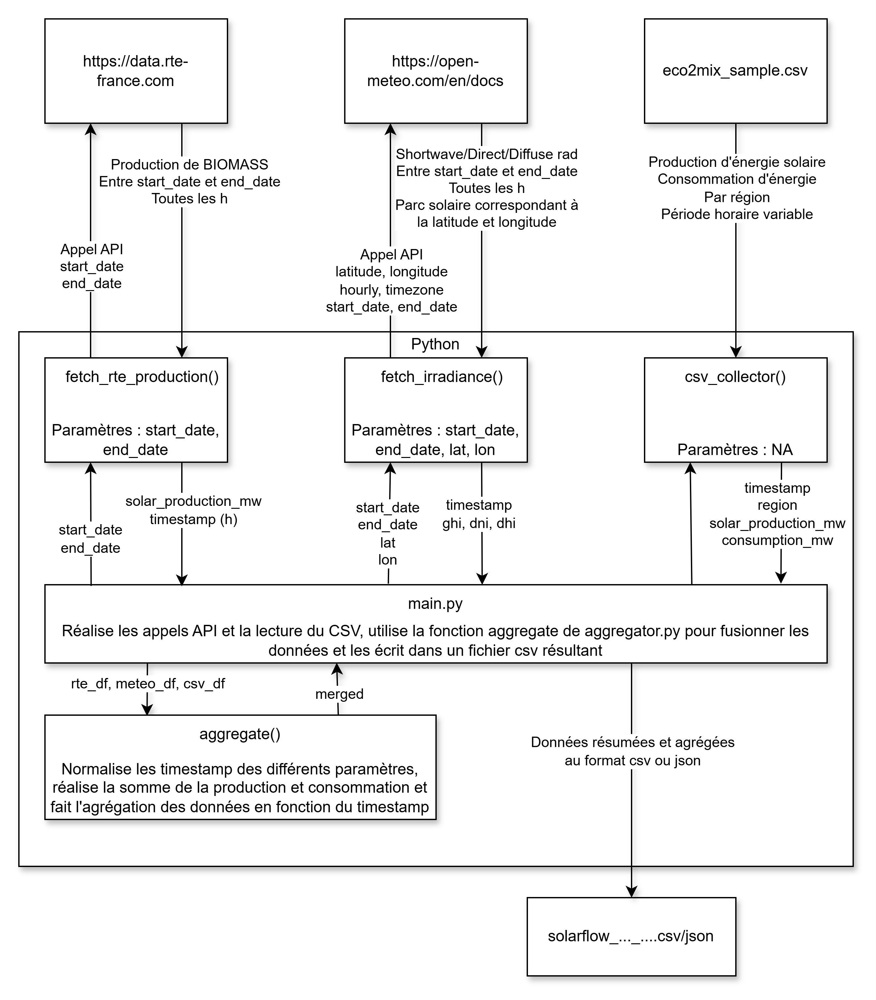

# SolarFlow

Pipeline de collecte et d'agrégation de données pour la prévision de production solaire.
Développé en interne chez **GreenWatt** pour alimenter le modèle de prévision J+1 des parcs solaires.
Le pipeline collecte des données depuis trois sources (RTE, Open-Meteo, éCO2mix), les agrège et produit un dataset horodaté prêt à l'emploi.

---

## Schémas d'architecture




- **API RTE** : production solaire réalisée et prévisions (données réseau national)
- **API Open-Meteo** : irradiance solaire horaire (GHI, DNI, DHI)
- **CSV éCO2mix** : historique régional de production par filière

---

## Prérequis

- **Python 3.13**
- **Credentials API RTE** : créer un compte sur [data.rte-france.com](https://data.rte-france.com), puis créer une application pour obtenir un `client_id` et un `client_secret`. L'accès à l'endpoint de production réelle est gratuit mais nécessite une validation du compte.

---

## Installation

```bash
# Installation de Python 3.13
winget install --id Python.Python.3.13 --exact
# Créer un environnement virtuel
py -3.13 -m venv .venv
source .venv/bin/activate      # Linux/macOS
.venv\Scripts\activate         # Windows

# Installer les dépendances (versions épinglées)
pip install -r requirements.txt

# Configurer les variables d'environnement
cp .env.example .env           # Linux/macOS
copy .env.example .env         # Windows
# Éditer .env et renseigner vos credentials RTE
```

---

## Utilisation

```bash
python main.py --start-date 2026-01-01 --end-date 2026-04-27
```

Options :
- `--start-date` : date de début (format YYYY-MM-DD, défaut : veille)
- `--end-date` : date de fin (format YYYY-MM-DD, défaut : aujourd'hui)
- `--output-format` : format de sortie `csv` ou `json` (défaut : `csv`)

Le fichier de sortie est généré dans le répertoire `output/` sous le nom `solarflow_YYYY-MM-DD_YYYY-MM-DD.csv`.

---

## Configuration

Copier `.env.example` vers `.env` et renseigner les variables suivantes :

| Variable | Description |
|---|---|
| `RTE_CLIENT_ID` | Client ID de l'application RTE (portail data.rte-france.com) |
| `RTE_CLIENT_SECRET` | Client Secret associé |
| `SOLAR_PARK_LAT` | Latitude du parc solaire (coordonnées GPS) |
| `SOLAR_PARK_LON` | Longitude du parc solaire |
| `OUTPUT_DIR` | Répertoire de sortie des fichiers générés |

> ⚠️ Ne jamais versionner le fichier .env. Il est listé dans .gitignore.

---

## Sources de données

### 1. API RTE — Actual Generation
- **URL** : [https://data.rte-france.com](https://data.rte-france.com)
- **Authentification** : OAuth2 — `client_id` + `client_secret` → `access_token` valable 1h
- **Endpoint utilisé** : `actual_generation/v1/actual_generations_per_production_type`
- **Données collectées** : production solaire nationale réalisée, granularité horaire
- **Colonne produite** : `solar_production_mw`
**Contraintes et limitations :**
- Requiert un compte validé sur le portail RTE (validation manuelle sous 24-48h)
- Le token OAuth2 expire toutes les heures — la pipeline en demande un nouveau à chaque exécution
- L'API ne retourne pas de données pour les dates futures (erreur `ACTUALGEN_PRODTYPE_F04`)
- Fenêtre de données disponibles : environ 2 ans d'historique

---
 
### 2. API Open-Meteo
- **URL** : [https://open-meteo.com](https://open-meteo.com)
- **Authentification** : aucune — API publique et gratuite
- **Données collectées** : irradiance solaire horaire (GHI, DNI, DHI) pour une localisation GPS
- **Colonnes produites** : `ghi`, `dni`, `dhi`
**Contraintes et limitations :**
- La pipeline sélectionne automatiquement l'endpoint selon la date demandée :
  - Date > 92 jours passés → API **forecast** (`api.open-meteo.com`)
  - Date ≤ 92 jours passés → API **archive** (`archive-api.open-meteo.com`)
- Limite de requêtes : 10 000 appels/jour sur le plan gratuit
- Un cache JSON local évite les appels répétés pour une même période
**Définitions des variables d'irradiance :**
| Variable | Nom complet | Description |
|---|---|---|
| `ghi` | Global Horizontal Irradiance | Rayonnement total reçu sur une surface horizontale |
| `dni` | Direct Normal Irradiance | Rayonnement direct perpendiculaire aux rayons solaires |
| `dhi` | Diffuse Horizontal Irradiance | Rayonnement diffus (ciel, nuages) sur surface horizontale |
 
---
 
### 3. CSV éCO2mix
- **URL** : [https://www.data.gouv.fr](https://www.data.gouv.fr) — rechercher "éCO2mix régional"
- **Authentification** : aucune — téléchargement manuel
- **Données collectées** : production solaire et consommation par région française, granularité 30 min
- **Colonnes produites** : `solar_production_mw_csv`, `consumption_mw`
**Contraintes et limitations :**
- Fichier à télécharger et placer manuellement dans `data/eco2mix_sample.csv`
- Couvre 24 régions françaises (13 régions métropolitaines + DOM-TOM + agrégats)
- Granularité irrégulière : les timestamps ne sont pas toujours alignés sur les heures rondes
- Le fichier peut contenir des lignes d'en-tête dupliquées — gérées automatiquement au chargement
- Les valeurs manquantes sont encodées sous plusieurs formes : `N/A`, `-`, `ND`, cellule vide

---

## Règles de nettoyage
 
La pipeline applique les règles de nettoyage suivantes, dans l'ordre, avant de produire le dataset final.
 
### 1. Déduplication
 
| Situation | Cause | Solution |
|---|---|---|
| Doublons RTE / Open-Meteo | Plages API qui se chevauchent | Moyenne des valeurs numériques par timestamp |
| Doublons CSV éCO2mix | Export avec lignes dupliquées | Moyenne par (timestamp, région) |
| Granularité irrégulière CSV | Publication éCO2mix à 30min irréguliers | Rééchantillonnage horaire + interpolation temporelle par région |
 
### 2. Filtrage des valeurs aberrantes
 
Les seuils physiques suivants sont appliqués sur chaque colonne. Les valeurs négatives sont corrigées à 0 (`clip`). Les valeurs dépassant le seuil maximum sont remplacées par `NaN`.
 
| Colonne | Seuil max | Justification |
|---|---|---|
| `solar_production_mw` | 22 000 MW | Capacité solaire installée France 2026 |
| `ghi` | 1 400 W/m² | Constante solaire atmosphérique max |
| `dni` | 1 000 W/m² | Irradiance directe max au sol en France |
| `dhi` | 600 W/m² | Irradiance diffuse max observée |
| `consumption_mw` | 102 000 MW | Record historique consommation France |
 
### 3. Gestion des valeurs manquantes (NaN)
 
| Colonne | NaN constatés | Origine | Traitement |
|---|---|---|---|
| `solar_production_mw` | ~58 | Décalage temporel RTE / Open-Meteo | Supprimés via inner join |
| `solar_production_mw_csv` | ~717 | CSV éCO2mix incomplet | Supprimés via inner join |
| `consumption_mw` | ~717 | CSV éCO2mix incomplet | Supprimés via inner join |
| `ghi`, `dni`, `dhi` | 0 | Source complète | Aucun traitement nécessaire |
 
**Choix documenté** : un `inner join` est appliqué lors de la fusion des trois sources. Seuls les timestamps présents dans les trois sources simultanément sont conservés. Ce choix garantit un dataset sans NaN pour l'entraînement du modèle ML, au prix d'une réduction d'environ 25% du volume de données pour notre exemple. En effet, l'API Open Météo ne permet pas de récupérer des données météo précédant trois mois avant la date d'appel de l'API.
