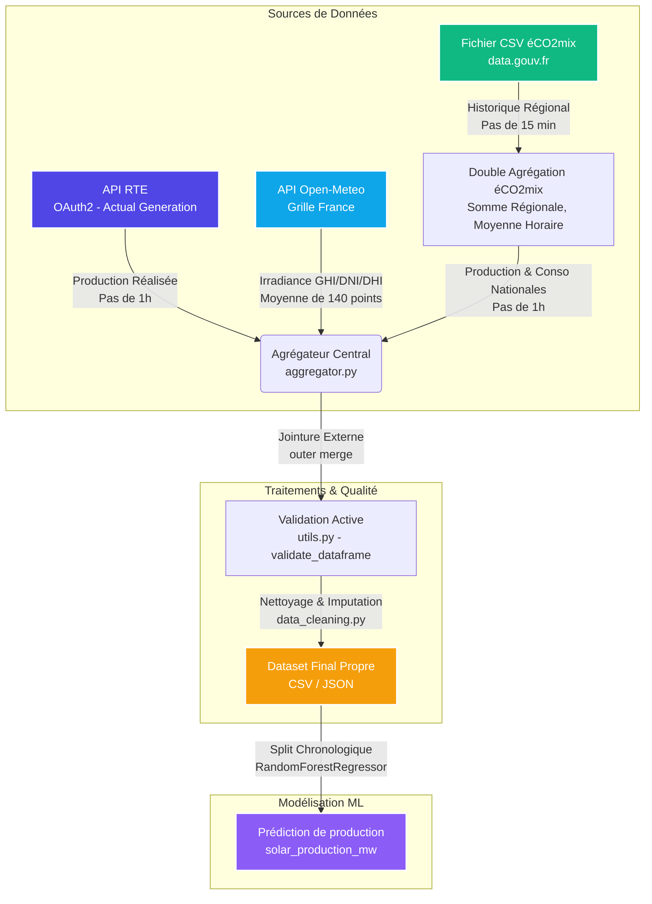

# SolarFlow — Pipeline de Prévision de Production Solaire (GreenWatt)

**SolarFlow** est le pipeline de données central développé pour la startup **GreenWatt**, spécialisée dans l'optimisation et la prévision de parcs solaires photovoltaïques.

L'objectif de ce pipeline est d'alimenter quotidiennement et de manière robuste les modèles de prévision de production à J+1 (Jeu de données d'apprentissage et d'inférence) en collectant, nettoyant et agrégeant des données provenant de trois sources distinctes.

---

## 📊 1. Architecture et Flux de Données

Le pipeline unifie les données à l'échelle nationale (France Métropolitaine) en combinant les mesures réseau réelles et les simulations météorologiques.



---

## 🔌 2. Description des Sources de Données

1. **API RTE (Actual Generation)** :
   * Mesures de la production solaire nationale réalisée (MW) au pas de temps horaire.
   * *Contraintes* : Authentification sécurisée OAuth2 (Client Credentials). Les requêtes utilisent des timestamps UTC (`Z`) pour éviter les erreurs de fuseaux horaires saisonniers.
2. **API Open-Meteo (Météo et Irradiance)** :
   * Données d'irradiance : $GHI$ (Global Horizontal), $DNI$ (Direct Normal), et $DHI$ (Diffuse Horizontal) en $W/m^2$.
   * *Contraintes* : API publique sans clé. Deux modes de fonctionnement sont configurés :
     * **Mode Point Unique** : Analyse géolocalisée sur un parc solaire spécifique.
     * **Mode Grille Nationale (Recommandé & Activé)** : Moyenne spatiale interpolée sur 140 points répartis sur toute la France métropolitaine pour s'aligner sur l'échelle de production nationale de RTE.
3. **Fichier CSV éCO2mix (data.gouv.fr)** :
   * Historique régionalisé de la consommation et de la production par filière au pas de temps de 15 minutes.
   * *Contraintes* : Encodage `latin1` et séparateur tabulateur (`\t`). Les dates sont au format français (`%d/%m/%Y %H:%M`) et subissent une conversion temporelle gérant les sauts d'heures d'été/hiver (DST).

---

## 🛠️ 3. Installation et Configuration

### Prérequis
* Python 3.13+

### Installation de l'environnement virtuel
```bash
# 1. Cloner le dépôt et se placer dans le répertoire
cd SolarFlow/Github

# 2. Créer l'environnement virtuel et l'activer
python -m venv .venv
.venv\Scripts\activate      # Windows (PowerShell)
source .venv/bin/activate   # Linux/macOS

# 3. Installer les dépendances
pip install -r requirements.txt
```

### Configuration des variables d'environnement (`.env`)
Copier le fichier `.env.example` en `.env` à la racine de `/Github` et configurer vos accès :
```ini
RTE_CLIENT_ID=your_client_id_here
RTE_CLIENT_SECRET=your_client_secret_here

SOLAR_PARK_LAT=43.6115
SOLAR_PARK_LON=3.8772

USE_NATIONAL_IRRADIANCE=true
IRRADIANCE_GRID_RESOLUTION=1.0

OUTPUT_DIR=output
```
*Note : Le fichier `.env` est exclu du versionnement par Git pour garantir la sécurité des credentials.*

---

## 🚀 4. Exécution du Pipeline et des Tests

### Lancement du pipeline
Pour lancer le pipeline de collecte, d'agrégation et de nettoyage sur une période spécifique :
```bash
python main.py --start-date 2026-01-01 --end-date 2026-04-27 --output-format csv
```

### Exécution de la suite de tests (`pytest`)
La suite de tests unitaires et d'intégration de bout en bout utilise des données synthétiques et des mocks pour valider le code sans dépendance au réseau ni aux clés API :
```bash
python -m pytest -v
```

---

## 🛡️ 5. Règles de Qualité et de Validation des Données

### A. Validation Active des DataFrames (`utils.py`)
Avant toute fusion, chaque source de données subit un contrôle strict et bloquant via la fonction `validate_dataframe` :
* **DataFrame vide ou nul** : 🛑 Exception bloquante `DataValidationError`.
* **Colonnes requises manquantes** : 🛑 Exception bloquante `DataValidationError`.
* **Valeurs NaT ou manquantes dans le timestamp** : 🛑 Exception bloquante `DataValidationError`.
* **Timestamps hors-plage majeure (battement > 3 jours)** : 🛑 Exception bloquante `DataValidationError`.
* **Timestamps hors-plage mineure (fuseaux/arrondis)** : ⚠️ Warning simple toléré pour la robustesse.

`main.py` intercepte spécifiquement `DataValidationError`, logge une alerte claire pour l'opérateur et s'arrête proprement avec le code de sortie `1`.

### B. Règles de Nettoyage et d'Imputation (`data_cleaning.py`)
* **Déduplication** : Suppression stricte des doublons temporels sur le `timestamp`.
* **Productions négatives** : Écrêtées à $0$ MW (production physiquement impossible).
* **Productions aberrantes** : Les valeurs $> 20 000$ MW (historiquement impossibles en France) sont supprimées.
* **Trous de collecte (NaN)** :
  * Météo : Interpolation linéaire (limite de 2h consécutives), puis `ffill` et `bfill`.
  * Production solaire : Imputée à $0$ MW (choix conservateur et physique pour les heures de nuit et les trous de collecte).
* **Incohérences Physiques Météo** :
  * **$DHI > GHI$** : 🛑 Élimination stricte (l'irradiance diffuse ne peut pas dépasser l'irradiance globale).
  * **$DNI > GHI$** : 🟢 Toléré et assoupli (possible lors d'angles solaires rasants en matinée/soirée ou sur des surfaces non horizontales).

---

## 📐 6. Résolution du Bug de Merge éCO2mix (x4)

Le pipeline d'origine présentait une anomalie majeure : les données nationales d'éCO2mix étaient multipliées par 4 lors du merge, affichant des consommations de l'ordre de ~200 GW au lieu de ~50 GW réels en France.

* **Cause racine** : L'arrondi temporel à l'heure pile (`floor("h")`) était effectué sur les données régionales à 15 minutes **avant** de sommer les 12 régions. Ce faisant, les quatre quarts d'heures de chaque région étaient additionnés de manière désordonnée lors du regroupement.
* **Correction apportée** dans `aggregator.py` :
  1. Somme nationale des 12 régions effectuée sur chaque quart d'heure d'origine (pas de 15 min).
  2. Arrondi temporel (`floor("h")`) appliqué sur le timestamp national consolidé.
  3. Moyenne horaire calculée sur les 4 quarts d'heure résultants pour obtenir une valeur horaire propre.
  *Cette double agrégation (Somme spatiale puis Moyenne temporelle) garantit des valeurs nationales cohérentes.*

---

## 🤖 7. Modélisation et Mesure d'Impact

Le modèle de régression `RandomForestRegressor` est entraîné pour prédire la production nationale `solar_production_mw` à partir des variables d'irradiance météo `ghi`, `dni`, et `dhi`.

### A. Comparaison Stricte (Conforme au Brief)
L'impact des correctifs de merge et du nettoyage rigoureux de SolarFlow est évalué ci-dessous avec les variables strictes demandées par le brief (`ghi`, `dni`, `dhi` uniquement), en appliquant un split chronologique strict (`shuffle=False` avec partition train de 80% et test de 20%) :

| Modèle RandomForest (ghi, dni, dhi uniquement) | RMSE (MW) | MAE (MW) | Coefficient $R^2$ |
| :--- | :---: | :---: | :---: |
| **Données Brutes (Avec Bug de Merge x4)** | 3982.38 MW | 2694.32 MW | 0.5322 (53.2%) |
| **Données Nettoyées Strictes (Sans variables additionnelles)** | 4243.91 MW | 2834.49 MW | 0.4602 (46.0%) |

*Note d'analyse : L'irradiance instantanée seule sans information temporelle est insuffisante pour capter l'historique de la journée ou l'angle solaire, expliquant la faible performance des modèles physiques simples. C'est pourquoi le Feature Engineering est indispensable.*

### B. Comparaison avec Modèle Amélioré (Feature Engineering Bonus)
Pour modéliser le cycle solaire (jour/nuit) et l'inertie du parc, des variables cycliques temporelles (`hour_sin`, `hour_cos`) et des variables de décalage (`prod_lag_1h`, `prod_lag_24h`) ont été intégrées :

| Modèle RandomForest Enrichi (Features de base + cycliques + lags) | RMSE (MW) | MAE (MW) | Coefficient $R^2$ |
| :--- | :---: | :---: | :---: |
| **Données Nettoyées & Enrichies** | **1190.12 MW** | **517.63 MW** | **0.9555 (95.5%)** |

*L'introduction de variables temporelles et historiques permet de diviser l'erreur quadratique (RMSE) par 3.5 et d'atteindre un pouvoir explicatif ($R^2$) de plus de 95%.*

* **Usage du LLM** : L'assistant IA a été exploité pour valider les incohérences physiques atmosphériques. Son analyse critique sur le distinguo nécessaire entre $DNI$ et $GHI$ (projections sur plans différents) a permis d'éviter un sur-nettoyage destructeur en assouplissant la règle $DNI > GHI$ au profit de la seule règle absolue $DHI > GHI$.

---

## ⚠️ 8. Limites Connues
* **Temps d'exécution de la grille météo** : En l'absence de cache local pour une longue période, la collecte séquentielle de la grille météo (140 points) peut prendre plusieurs minutes.
* **Bruit d'imputation nocturne** : Imputer la production solaire à $0$ MW en cas de NaN nocturne est physiquement exact, mais en cas de trou de collecte en plein après-midi, cela introduit un biais conservateur sous-estimant temporairement la production réelle.
